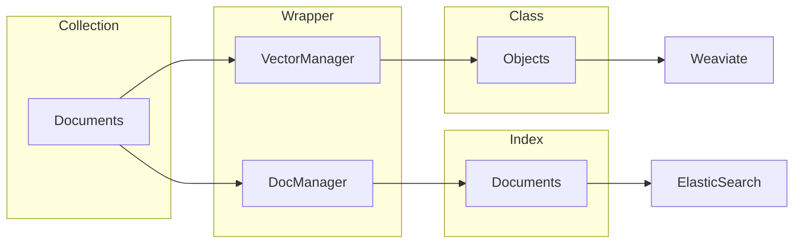

# IR Gateway
 The gateway serves as the primary point of communication with various databases, but each database has its own unique conventions and structures.

We will utilize the [wrapper design pattern](https://en.wikipedia.org/wiki/Adapter_pattern) to enable the use of a single, consistent interface to access several types of databases while encapsulating and abstracting away the complex interaction with each database. This makes switching between interfaces simple and eliminates the need to focus on the specific of each database.

Every data entry through the gateway is termed a **document**. Collectively, these documents are known as a **collection**. This is the convention we follow for our gateway and the wrapper with change the information to map to the respective items in the database. The relationship is demonstrated below:



## Key Terminologies:
|    **Term**    	| **ElasticSearch<br>Equivalent** 	| **Weaviate<br>Equivalent** 	|
|:--------------:	|:-------------------------------:	|:--------------------------:	|
| **Collection** 	|              Index              	|            Class           	|
|  **Document**  	|             Document            	|           Object           	|
|  **Schema**     	|              Mapping              |           Schema           	|
|  **doc_id**     	|              _id                  |            uuid           	|

## Full Glossary Reference:
- [ElasticSearch](https://www.elastic.co/guide/en/elastic-stack-glossary/current/terms.html)
- [Weaviate](https://weaviate.io/developers/weaviate/current/more-resources/glossary.html)


# Supported Frameworks
The following framework has their wrapper written for. Subsequent frameworks may refer to the existing wrapper. 
### Document Database:
- Elasticsearch
### Vector Database:
- Weaviate

# Setup
Setting up ElastDocker
```
git submodule init
git submodule update
cd doc_db/elastdocker
make setup
sysctl -w vm.max_map_count=262144
make elk
```

[//]: <> (TODO: Find the exec command)
Start IR Gateway
```
cd build
docker-compose up
docker exec -it ir_template_gateway_1 /bin/bash
```

# Usage
1) Configure all endpoints inside `build/.env`

[//]: <> (TODO: Refer to example.py)

2) Within your python script, import the wrappers
    ```
    from utils.ESManager import DocManager
    from utils.WeaviateManager import VectorManager

    DocMgr = DocManager()
    VecMgr = VectorManager()
    ```

3) Create a schema for the collection. Below are the following supported data types:
    - `int`
    - `float`
    - `double`
    - `str`
    - `bool`
    - `datetime`
    - `list[int]`
    - `list[str]`
    - `list[float]`
    - `list[double]`
    - `torch.tensor`
    - `numpy.ndarray`

    Note:
    - Weaviate ignores `torch.tensor` and `numpy.ndarray` fields during schema parsing because there will be a dedicated parameter for uploading vector.
    - Weaviate **DOES NOT** support nested schema.
    - It is required for Weaviate schema to contain `doc_id` field, which is used for alignment of id across multiple frameworks. The baseline id shall be the one from ElasticSearch. For any operations involving vectors, include `vector` field in the dictionary submitted to the embedding manager. 

    Some example of a schema is as shown:
    - Standard schema
    ```
    user_schema = {
        "name":"str",
        "doc_id":"str",
        "age":"int",
        "school":"str",
        "grades":"float"
    }
    ```
    - Nested schema (Only supported in ElasticSearch)
    ```
    user_schema = {
        "name": "str",
        "age": "int",
        "education": {
            "university": {
            "school": "str",
            "grades": "float"
            }
        },
        "vector":"torch.tensor"
    }
    ```

4) Using the above schema, create a collection. The schema is compatible across all wrapped frameworks. 
    ```
    DocStore = DocMgr.create_collection(collection_name="personnel", schema=user_schema)
    VecStore = VecMgr.create_collection(collection_name="personnel", schema=user_schema)
    ```

# Functions

### Collections
- ```create_collection(collection_name: str, schema: dict)```
    - Creates a collection with the collection name and the schema.
    - **Parameters**:
        - **collection_name**: Name of the collection
        - **schema**: A dictionary consisting of all the fields (Note: Schema of Weaviate requires `doc_id` field)
- ```delete_collection(collection_name: str)```
    - Deletes the indicated collection
    - **Parameters**:
        - **collection_name**: Name of the collection

### Documents
[//]: <> (TODO: Align and fix create_document for weaviate)

- (ElasticSearch) ```create_document(collection_name: str, documents: Union[list, dict], id_field: str=None)``` 
<br /> (Weaviate) ```create_document(collection_name: str, documents: Union[list, dict])``` 
    - Creates document within the collection. 
    - **Parameters**:
        - **collection_name**: Name of the collection
        - **documents**: Dictionary containing all the fields and its value for the document to be created. For bulk uploading, consolidate documents in a list before passing it as documents.
        - **id_field** (ElasticSearch): Specify the field from the documents to use as the internal id value. If no field is indicated, then ElasticSearch's generated id will be used instead. 

- ```delete_document(collection_name: str, doc_id: str)```
    - Deletes the specific document within collection by its id.
    - **Parameters**:
        - **collection_name**: Name of the collection
        - **doc_id**: id of document to be deleted

- ```read_document(collection_name: str, doc_id: str)```
    - Look up a specific document by its doc_id
    - **Parameters**:
        - **collection_name**: Name of the collection
        - **doc_id**: id of document of interest

- ```update_document(collection_name: str, doc_id:str, document: dict)```
    - Update a specific document by its doc_id
    - **Parameters**:
        - **collection_name**: Name of the collection
        - **doc_id**: id of document to be updated
        - **document**: Dictionary containing the fields and its value for the document to be updated. Only fields found in the dictionary will be updated. 

- (ElasticSearch) ```query_collection(collection_name: str, field_value_dict: dict)```
    - Query collection based on the fields and values
    - **Parameters**:
        - **collection_name**: Name of the collection
        - **field_value_dict**: A dictionary with the field to be queried as the key, and the value to be queried as the value of the dictionary

- (ElasticSearch) ```custom_query(collection_name: str, query: dict)```
    - Query ElasticSearch collection based on custom query (identical to querying on Kibana's Dev Tools)
    - **Parameters**:
        - **collection_name**: Name of the collection
        - **query**: A dictionary with the field to be queried as the key, and the value to be queried as the value of the dictionary

- (ElasticSearch) ```get_all_document(collection_name: str)``` 
    - Generator function that returns all documents within the collection. 
    - **Parameters**:
        - **collection_name**: Name of the collection

- (Weaviate) ```get_top_k(collection_name: str, target_embedding: Union[list, numpy.ndarray, torch.Tensor], top_k: int = 1)``` 
    - Query a vector collection to retrieve the top k most similar embeddings
    - **Parameters**:
        - **collection_name**: Name of the collection
        - **target_embedding**: The vector to be compared against the database
        - **top_k**: Number of results to return. (Maximum 100) 

### Graph

- (Neo4j) ```create_graph(collection_name: str, triples: List[dict])``` 
        - Creates document within the collection. </br>
        - **Parameters**:
            - **collection_name**: Name of the collection for the Graph to be created
            - **triples**: List of nested dictionaries where each dictionary is a triple containing 3 nested dictionaries for the `Subject`, `Predicate`, and `Object` of the triple. 

github don't let me commit to main :(