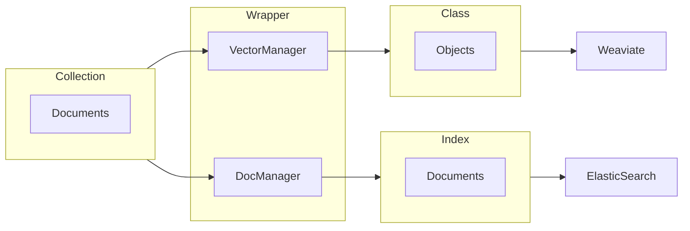
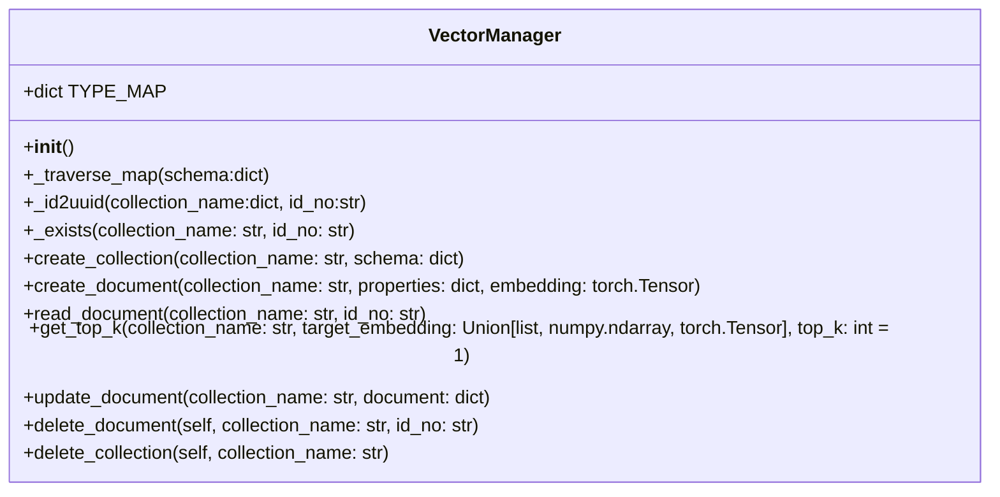

# IR Gateway
 The gateway serves as the primary point of communication with various databases, but each database has its own unique conventions and structures.

We will utilize the [wrapper design pattern](https://en.wikipedia.org/wiki/Adapter_pattern) to enable the use of a single, consistent interface to access several types of databases while encapsulating and abstracting away the complex interaction with each database. This makes switching between interfaces simple and eliminates the need to focus on the specific of each database.

Every data entry through the gateway is termed a **document**. Collectively, these documents are known as a **collection**. This is the convention we follow for our gateway and the wrapper with change the information to map to the respective items in the database. The relationship is demonstrated below:



## Key Terminologies:
|    **Term**    	| **ElasticSearch<br>Equivalent** 	| **Weaviate<br>Equivalent** 	|
|:--------------:	|:-------------------------------:	|:--------------------------:	|
| **Collection** 	|              Index              	|            Class           	|
|  **Document**  	|             Document            	|           Object           	|
|                	|                                 	|                            	|


# Supported Frameworks
The following framework has their wrapper written for. Subsequent frameworks may refer to the existing wrapper. 
### Document Database:
- Elasticsearch
### Vector Database:
- Weaviate

# Setup
Setting up ElastDocker
```
git submodule init
git submodule update
cd doc_db/elastdocker
make setup
sysctl -w vm.max_map_count=262144
make elk
```

[//]: <> (TODO: Find the exec command)
Start IR Gateway
```
cd build
docker-compose up
docker exec -it 
```

# Usage
1) Configure all endpoints inside `build/.env`

[//]: <> (TODO: Refer to example.py)

2) 
```
from utils.ESManager import DocManager
from utils.WeaviateManager import VectorManager

DocMgr = 
```

### Weaviate Wrapper -> `VectorManager`

You can import the `VectorManager` from `WeaviateManager`

Below is a quick overview of the attribute and methods of the class. All public methods i.e. those methods that do not start with `_` will return a python dictionary.



#### Usage

In the documentation, it is assumed that you have imported and you assign `client = VectorManager()`

> To create collection `client.create_collection(collection_name: str, user_schema: dict) -> dict`
```python
user_schema = {
    "id_no":"str",
    "age":"int",
}
client.create_collection(collection_name='Faces', schema=user_schema)
"""
{'response': 200}
"""
```

The wrapper will transform the above to 
```python
[
    {
        'name': 'id_no',
        'dataType': ["text"]
    },{
        'name': 'age',
        'dataType': ["int"],
    }
]
```

The entire mapping relationship is done with a dictionary as shown:
```python
TYPE_MAP = {
    #Python type: Weaviate data type 
    "int":["int"],
    "float":["number"],
    "double":["number"],
    "str": ["text"],
    "bool": ["boolean"],
    "datetime": ["date"],
    "list[int]":["int[]"],
    "list[str]":["text[]"],
    "list[float]": ["number[]"],
    "list[double]": ["number[]"],
}
```

> To create a document `create_document(self, collection_name: str, properties: dict, embedding: torch.Tensor) -> dict`

The properties cannot contradict the data type in the schema, but it could have new fields

```python
data_obj = {
    "id_no": "1",
    "age": 2
}
face_emb = torch.Tensor([0.5766745, 0.9341823, 0.7021697, 0.54776406, 0.013553977])
client.create_document(collection_name = 'Faces', properties = data_obj, embedding = face_emb)
"""
{'response': 200}
"""
```
> To read a specific document `read_document(self, collection_name: str, id_no: str) -> dict`

```python
client.read_document(collection_name='Faces', id_no = "1")
"""
{
    'response': {
        'class': 'Faces',
        'creationTimeUnix': 1671087077726,
        'id': '258953ae-4aad-43dc-aa9d-5f74bf38dfc4',
        'lastUpdateTimeUnix': 1671087077726,
        'properties': {'age': 1, 'id_no': '1'},
        'vector': [0.14229017, 0.43621045, 0.3271194, 0.9458164, 0.36649644],
        'vectorWeights': None
    }
}
"""
```
> To get similar document(s) base on a vector of embedding `get_top_k(self, collection_name: str, target_embedding: Union[list, numpy.ndarray, torch.Tensor], top_k: int = 1) -> dict`

```python
embedding = torch.Tensor([0.5766745, 0.9341823, 0.7021697, 0.54776406, 0.013553977])
client.get_top_k(collection_name='Faces', target_embedding=embedding, top_k=3)

"""
{
    'response': [{
        'response': {'class': 'Faces',
        'creationTimeUnix': 1671087077765,
        'id': '156443f7-df34-479e-8274-59833a1655ef',
        'lastUpdateTimeUnix': 1671087077765,
        'properties': {'id_no': '11', 'new': '2'},
        'vector': [0.5766745, 0.9341823, 0.7021697, 0.54776406, 0.013553977],
        'vectorWeights': None},
        'certainty': 0.9999999403953552
    },{
        'response': {'class': 'Faces',
        'creationTimeUnix': 1671087077751,
        'id': 'e999d2c4-22cb-420b-b114-52ecaf97f7e5',
        'lastUpdateTimeUnix': 1671087077751,
        'properties': {'age': 8, 'id_no': '8'},
        'vector': [0.3250035, 0.38524753, 0.38620043, 0.4955626, 0.06325245],
        'vectorWeights': None},
        'certainty': 0.97750523686409
    },{
        'response': {'class': 'Faces',
        'creationTimeUnix': 1671087077754,
        'id': 'fba70226-d09a-4403-ad9d-d8cb00058a2a',
        'lastUpdateTimeUnix': 1671087077754,
        'properties': {'age': 9, 'id_no': '9'},
        'vector': [0.44360954, 0.9544769, 0.73395604, 0.38870186, 0.5922022],
        'vectorWeights': None},
        'certainty': 0.9545671939849854
    }]
}
"""

```

> To update a document `update_document(self, collection_name: str, document: dict) -> dict`

```python
update = {
    'id_no': '1',
    'vector': torch.rand(1, 5),
    'age': 1
}
client.update_document(collection_name='Faces', document = update)
"""
{'response': 200}
"""
```

The update dictionary can have lesser field but it must at least have `id_no`

> To delete a docment `delete_document(self, collection_name: str, id_no: str) -> dict`

```python
client.delete_document(collection_name, "1")
"""
{'response': 200}
"""
```

> To delete a collection `delete_collection(self, collection_name: str) -> dict`

```python
client.delete_collection(collection_name='Faces')
"""
{'response': 200}
"""
```


